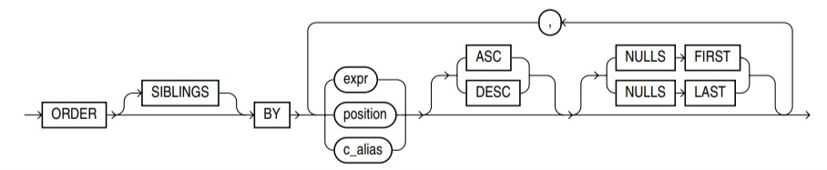

#  Fonction générant une valeur aléatoireOracle SQL

\< > : quelle chose à remplir

{ | } : champ obligatoire, des options aux choix

[ ] : champ facultatif

## 1. Notion d'administration

### 1.1 Rappel

Entité, Rubrique, Identifiant, Association, Cardinalité, Type

- Relation : schéma et extension

  Un __schéma__ composé d'une liste de n attributs typés R = [a1, ..., ai, ..., an] -> les en-têtes du tableau

  Une __extension__ composée d'un ensemble de tuples (n-uplets) donc l'ordre n'a pas d'importance -> les contenus du tableau

  Une __relation__ est définie par un __schéma__ et une __extension__ -> un tableau

- Clé primaire (PK)

  Une __clé primaire__ 

  - doit être définie pour chaque relation
  - porte sur un ou plusieurs attributs (clé simple vs composée)
  - a les caractéristiques suivantes
    - unique : un tuple est identifié sans ambiguïté
    - non-nulle : tous ses constituants sont renseignés

- Clé étrangère (FK)

  Une __clé étrangère__ 

  - garantit l'intégrité référentielle
  - a une __source__ composée d'un ou plusieurs attributs -> si
  - a une __cible__ composée d'un ou plusieurs attributs -> cj
  - est matérialisée par une propiété d'inclusion -> si appartient à cj

- SQL : Structured Query Language

  - __LDD__ Language de Définition des Données

    create, alter, rename, drop

  - __LMD__ Language de Manipulation des Données

    insert, update, delete

  - __LID__ Language d'Intérrogation des données

    select

  - __LCD__ Language de Contrôle sur les Données

    grant, revoke

  - __LCT__ Language de Contrôle des Transactions

    commit, rollback

### 1.2 Les SGBD

Objectifs des SGBD

- Un __système d'information__ est un système permettant le __recueil__, le __contrôle__, la __mémorisation__ et la __distribution__ des informations nécessaires à l'exercice de l'activité de l'organisation

- Une __base de données__ est un __ensemble structuré de données__ enregistrées sur des supports accessibles par l'ordinateur pour satisfaire simultanément __plusieurs utilisateurs__ de manière sélective et en un __temps opportun__ 
  - Elimination de la redondance des données
  - Centralisation et organisation correcte des données
  - Apports du Système de Gestion de Bases de Données (SGBD)
    - Factorisation des modules de contrôle des applications
    - Interrogation, cohérence, partage, gestion des pannes...
    - Administration facilitée des données

### 1.3 Notion d'administration Oracle

#### Création d'un utilisateur

```plsql
create user <username>
default tablespace users
identified by <userpassword>
quota {unlimited|<... Octet>} on users;
```

#### Octroi et révocation des privilèges

```plsql
grant {all privileges|priv1,priv2,...,privN} to {<username>|<groupname>};
grant <groupname> to <username>;
```

#### Révocation de privilèges

```plsql
revoke {all privileges|priv1,priv2,...privN} from {<username>|<groupname>};
revoke <groupname> from <username>;
```

#### Définir des rôle pour regrouper les privilèges

```pls
create role <groupname>;
```

Le rôle prédéfini dba rassemble tous les privilèges

Privilèges :

- create session
- create table
- create view
- create sequence
- select
- insert

#### Sauvegarde et restauration de schémas

- Export de données

  ```plsql
  exp <username> file=<filename>.dmp
  ```

- Vues du méta-schéma

  ```plsql
  imp <username> file=<filename>.dmp
  ```

  Le __méta-schéma__ du SGBD mémorise des __informations sur les objets__ qu'il gère : tablespaces, utilisateurs, tables, vues, procédures, etc. Il comprend des vues qui sont __mises à jour automatiquement__. Ces __vues__ préfixées de all_ dba_ et user_ sont __intérrogables__ par les utilisateurs

  - Vues préfixées par __dba__ 
    - Listent les info sur __tous les objets__ de la BD
    - Seuld les administrateurs (sys, system, ...) peuvent interroger ces vues
  - Vues préfixées par __all__ 
    - Listent les info sur les __objets accessibles__ par l'utilisateur courant
  - Vues préfixées par __user__ 
    - Listent les info sur les __objets possédés__ par l'utilisateur courant

  | Table ou vue | Description |
  | ------------ | ----------------- |
  | all_catalog | Liste des objets accessibles par l'utilisateurs courant |
  | all_users | Liste des utilisateurs créés sur l'instance courante |
  | user_segments | Informations sur l'espace disque occupé par les objets |
  | user_ts_quotas | Quotas fixés sur les tablespaces de l'utilisateur courant |
  | user_objects | Objets créées par l'utilisateur courant |
  | user_tables | Tables créées par l'utilisateur courant |
  | user_tab_columns | Colonnes des tables créées par l'utilisateur courant |
  | user_constraints | Contraintes créées sur des tables de l'utilisateur courant |
  | user_cons_columns | Colonnes ciblées par les contraintes créées sur des tables |
  | user_procedures | Procédures et fonctions créées par l'utilisateur courant |
  | user_triggers | Déclencheurs créés par l'utilisateur courant |
  | user_views | Vues créées par l'utilisateur courant |
  | user_sys_privs | Privilèges "système" octroyés à l'utilisateur courant |
  | user_tab_privs | Privilèges "objet" octroyés / reçu à / par l'utilisateur courant |
  | user_tab_privs_recd | Privilèges reçus par le compte courant par d'autres |
  | user_tab_privs_made | Privilèges octroyés par le compte courant à d'autres |
  | user_role_privs | Rôles octroyés à l'utilisateur courant |
  

## 2. LDD, LMD & LCT

### 2.1 LDD Langage de définition des données

- Colonnes

  | Type Oracle              | Description                                                  |
  | ------------------------ | ------------------------------------------------------------ |
  | char(n [byte\|char])     | Chaîne de caractères de longeur fixe de n[1, 4000] octets (byte) ou caractères (char) |
  | varchar2(n [byte\|char]) | Chaîne de caractères de longeur variable de n[1, 4000] octets (byte) ou caractères (char) |
  | number[(p [, e])]        | Nombre avec précision p et échelle e - p le nombre de chiffres totaux, e le nombre de chiffres après la virgule |
  | date                     | Date valide dans [01/01/2020] Champs : day, month, hour, minute et second |
  | clob                     | Chaîne de caractères de longeur variable                     |
  | blob                     | Chapine binaire                                              |

- Tables

#### Création de table

```plsql
create table <tablename>{
  column1 type1,
  column2 type2,
  ...
  columeN typeN
};
```

- Contraintes

  Les noms des contraintes conseillés :

  - pk : pk_\<tablename>
  - fk : fk\_\<tablename>_\<foreignkeyname>
  - ck : ck\_\<tablename>_\<fieldname>
  - nn : nn\_\<table>_\<fieldname>
  - un : un\_\<tablename>_\<fieldname>

#### Rajout de contraintes PK, FK, CK et UN

```plsql
alter table <tablename> add{
	constraint <pkname> primary key(<fieldname>),
	constraint <fkname> foreign key(foreignkeyname) references <cibletable>,
	constraint <ckname> check(<condition>)
	constraint <unname> unique(<fieldname>)
};
```

#### Rajout de contraintes NN

```plsql
alter table <tablename> modify{
	<fieldname> constraint <nnname> not null
};
```

#### Intérrogation du méta-schéma

```plsql
select <tablename> from user_tables;

desc <tablename>;

select constraint_name, constraint_type, status, search_condition
from user_constraints
where table_name = 'tablename'
order by constraint_name;
```

- Tables et contraintes

#### Manipulations des tables

```plsql
-- création d'une table avec ses contraintes
create table <tablename>{
	column1 type1 constraint <pkname> primary key,
	column2 type2 constraint <nnname> not null,
	...
	columeN typeN constraint <nnname> not null,
	constraint <fkname> foreign key(foreignkeyname) references <cibletable>,
	constraint <ckname> check(<condition>),
	constraint <unname> unique(columnI)
};
-- création d'une table à partir du résultat d'une requête
create table <tablename> as
	select *
	from <tablename2>
	where <condition>;
-- renommage d'une table
alter table <tablename> rename to <tablename2>;
-- suppression de table
drop table <tablename>;
-- suppression des FK entrantes
drop table <tablename> cascade constraints;
```

#### Manipulations des colonnes

```plsql
-- ajout d'une colonne
alter table <tablename> add column1 type1[ constraint <constraintname> <constraintcondition>];
-- renommage d'une colonne
alter table <tablename> rename column <columnname> to <columnname2>;
-- modification d'une colonne
alter table <tablename> modify {type1|default <value1>};
-- suppression d'une colonne
alter table <tablename> drop column <columnname>
```

#### Manipulations des contraintes

```plsql
-- désactivation de contrainte
alter table <tablename> disable constraint <constraintname>;
-- activation de contrainte
alter table <tablename> enable constraint <constraintname>;
-- suppresion de contrainte
alter table <tablename> drop constraint <constraintname>;
-- cas particulier de la PK
alter table <tablename> disable primary key;
alter table <tablename> enable primary key;
alter table <tablename> drop primary key;
alter table <tablename> drop primary key cascade;
```

### 2.2 LMD Langage de manipulation des données

#### Insertion : insert

```plsql
insert into <tablename> [(column1,column2,...,columnN)] values(value1,value2,...valueN);
-- value -> sous-requête
insert into <tablename> [(column1,column2,...,columnN)]
	select value1,value2,...valueN
	from ...
	...;
-- séquence
create sequence <sequencename>
	[start with N]
	[increment by M];

insert into ... values(<sequencename>.nextVal,...);
```

#### Modification : update

```plsql
update <tablename> 
	set column1=value1[,column2=value2,...columnN=valueN]
	[where <condition>];
-- value1 -> sous-requête
update <tablename>
	set (colume1,column2,...columnN)=(select column1,column2,...columnN from ...)
	[where <condition>];
```

#### Suppression : delete

```plsql
delete [from] <tablename>
	[where <condition>];
```

### 2.3 LCT Langage de contrôle des transactions

- Une __transaction__ est une séquence d'une ou plusieurs __instructions SQL__ caractérisées par : 
  - un __état initial__ des données qui est __cohérent__ : le début de transaction -> connexion ou __commit__ 
  - des __états intermédiaires__ des données qui sont __incohérents__ 
  - un __état final__ des données __cohérent__ : la fin de transaction -> déconnexion "propre", __commit__ ou exécution d'un ordre du LDD

- Validation : commit

  __Valide les modifications__ de la transaction courante -> écriture sur disque

- Annulation : rollback

  __Annule les modifications__ effectuées durant la transaction

  Une panne du SGBD ou une perte de connexion fait un rollback automatique

- Les __transactions__ permettent la mise en oeuvre de modifications impliquant plusieurs instructions SQL, sue le __principe du "tout ou rien"__ 

## 3. LID

### Projection

```plsql
select columnI,columnJ
from <table>;
```

### Selection

```plsql
select *
from <table>
where <condition>;
-- tri des résultats
...
order by columnI [asc,desc][nulls {first|last}][, columnJ]
-- élimination des doublons
select distinct ...
```



__Les opérateurs de sélection__ 

=, <> / != / ^=, >, >=, <, <=

a is null -> Nullité de a / a n'est pas renseigné

a is not null -> Non-nullité de a est renseigné

___X = null / X != null est toujours évaluée à faux___ 

__Les opérateurs de sélection sur opérande ensembliste__ 

a in (X) / a = any (X) / a = some (X) -> Présence de la valeur a dans l'ensemble X

a not in (X) / a <> all (X) -> Absence de la valeur a dans l'ensemble X

a > all (X) -> La valeur a est supérieure aux valeurs de X

a >= all (X) -> La valeur a est supérieure ou égale aux valeurs de X

#### Composition des sous-requêtes

Les sous-requêtes peuvent composées par les sous-requêtes (Les poupées russes)

```plsql
select ...
from ...
where <fieldname> in (<sous-requête>);
select ...
from ...
where <fieldname> >= all (<sous-requête>);
-- vue -> expression
create view <viewname> as
	<requête>;
-- utilisation d'une vue
select ...
from ...
where ... in (select ...
              from <viewname>);
-- vue interne
with <viewname> as(
	<requête>
)
-- utilisation d'une vue interne
select ...
from ...
where ... in (select ...
              from <viewname>);
```

### Opérateurs ensemblistes

```plsql
-- union
<requête>
union
<requête>;
-- union all -> conservant lignes identiques
<requête>
union all
<requête>;
-- intersection
<requête>
intersect
<requête>;
-- différence : les données qui sont dans le premier résultat mais pas dans le deuxième résultat
<requête>
minus
<requête>;
-- exists
select ...
from a
where exists (select ...
              from b
              where a.x1 = [b.]x1);
-- équivalent à
select ...
from a
where x1 (select ...
          from b
          where x1 is not null);
```

### Groupement

```plsql
select <projections> [<groupement>]
from ...
...
group by <projection>
[having <conditiondugroupement>]
[order by ...];
```

<span id="groupement">Les fonctions du groupement</span> 

| Fonction               | Description                                                  |
| ---------------------- | ------------------------------------------------------------ |
| count(*)               | Nombre __total__ de ligne                                    |
| count(column)          | Nombre de lignes dont la valeur de column __n'est pas vide__ |
| count(distinct column) | Nombre de valeurs __non nulles__ distinctes dans column      |
| min(column)            | Valeur minimale dans column                                  |
| max(column)            | Valeur maximale dans column                                  |
| sum(column)            | Somme des valeurs de column                                  |
| avg(column)            | Moyenne des valeurs de column                                |
| stddev(column)         | Ecart-type des valeurs de column                             |
| median(column)         | Valeur médiane de column                                     |

### Produit

Les données en produit cartésien

```plsql
select ...
from <tablename> cross join <tablename2>;
```

### Jointure

- Jointure naturelle

  ```plsql
  select ...
  from <tableA>, <tableB>
  where <tableA>.<field> = <tableB>.<field>; -- les colonnes en commun
  ----
  select ...
  from <tableA> natural join <tableB>;
  ```

- Semi-jointure gauche / droite

  ```plsql
  select <tableA>.* / select <tableB>.*
  where <tableA> natural join <tableB>
  ```

- θ-jointure

  ```plsql
  -- un champ de caractéristique A est supérieur un champs de caractéristique B
  select T1.<field> t1, T2.<field> t2
  from <tableA> T1, <tableB> T2
  where T1.<field2> > / < / >= / <= / != T2.<field2>
    and T1.<field3> = <caractA>
    and T2.<field3> = <caractB>
  ```

- Equi-jointure

  ```plsql
  select ...
  from <tableA> join <tableB> using <field> -- une colonne en commun pour la jointure
  -- s'il y a qu'une colonne en commun, c'est une jointure naturelle aussi
  ```

- Auto-jointure

  ```plsql
  select T1.<field> t1, T2.<field> t2
  from <tableA> T1, <tableB> T2
  where T1.<field2> = T2.<field2>
    and T1.<field3> = <caractA>
    and T2.<field3> = <caractB>
  ```

- Jointure externe gauche / droit TableA TableB

  Les résultats sont les résultat de la jointure naturelle de TableA et TableB + les lignes de TableA / TableB __n'ont pas été appariées__ avec TableB, TableA

  ```plsql
  select ...
  from <tableA> left/right outer join <tableB> on <tableA>.<field> = <tableB>.<field>;
  -- gauche
  select ...
  from <tableA>, <tableB>
  where <tableA>.<field> (+) = <tableB>.<field>
  -- droite
  select ...
  from <tableA>, <tableB>
  where <tableA>.<field> = <tableB>.<field> (+)
  ```

- Jointure externe complète

  Les résultats = Jointure Gauche Union Jointure Droite

  ```plsql
  select ...
  from <tableA> full outer join <tableB> on <tableA>.<field> = <tableB>.<field>;
  ```

## 4. Fonctions SQL internes et PL/SQL

### Fonction SQL internes

Fonctions orientées colonne

- Null

  nvl(x, r) 

  si x is not null = x

  sinon = r

- [Groupement](#groupement) 

Fonctions orientées ligne

- Decode

```plsql
-- decode only in Oracle
select ... decode(x, value1, result1[, value2, result2,..., valueN, resultN], defaultvalue)
-- if x = value1 -> decode(...) = result1
-- équivalent à (norme SQL-92)
case x
	when value1 then result1
	[
    when value2 then result2
    ...
    when valueN then resultN
    ]
    else defaultvalue
end [as <name>]
```

- Nombres (select ... from dual)

  | Fonction          | Description                                         |
  | ----------------- | --------------------------------------------------- |
  | abs (x)           | Valeur absolue de x                                 |
  | ceil (x)          | Valeur plafond de x                                 |
  | floor(x)          | Valeur plancher de x                                |
  | round (x[, n])    | Arrondit x à n décimales (n = 0 par défaut)         |
  | trunc (x[, n])    | Tronque x à n décimales (n = 0 par défaut)          |
  | to_number(s[, f]) | Convertit en nombre la chaîne s exprimé en format f |
  | least (a, b)      | Plus petit nombre entre a et b                      |
  | greatest (a, b)   | Plus grand nombre entre a et b                      |
  | power (x, n)      | Puissance x^n                                       |
  | sqrt (x)          | Racine carrée √(x)                                  |
  | exp (x)           | Exponentielle e^x                                   |
  | log (x, b)        | Logarithme log b (x)                                |
  | ln (x)            | Logarithme népérien log e (x)                       |
  | cos (x)           | Cosinus de x                                        |

- Chaînes de caractères

  | Fonction           | Description                                                  |
  | ------------------ | ------------------------------------------------------------ |
  | ascii (c)          | Code ASCII correspondant au caractère c                      |
  | chr (n)            | Caractère correspondant au code ASCII n                      |
  | initcap (s)        | Transforme l'initiale de chaque mot de s en lettre capitale  |
  | length (s)         | Longueur de la chaîne s                                      |
  | lower (s)          | Convertit une chaîne s en lettres minuscules                 |
  | upper (s)          | Convertit une chaîne s en lettres majuscules                 |
  | soundex (s)        | Valeur représentant s avec l'algorithme Soundex              |
  | trim (s)           | Enlève les espaces en début et en fin de s                   |
  | a \|\| b           | Concatène les chaîne  a et b                                 |
  | concat (a, b)      | Concatène les chaîne  a et b                                 |
  | substr (s, d[, f]) | Extrait f caractère de s à partir de l'index d>=1            |
  | instr (s, c)       | Retourne la position de c dans s ou 0 si c existe pas        |
  | replace (s, a, b)  | Remplace a par b dans la chaîne s                            |
  | translate(s, a, b) | Convertit les caractères de a par ceux de b dans s           |
  | like '_%'          | _ représente un seul caractère, % représente zéro ou plusieurs caractères |

- Date

  | Fonction                | Description                                                  |
  | ----------------------- | ------------------------------------------------------------ |
  | sysdate                 | Date-hure système                                            |
  | d + n                   | Ajoute n (entier) jours à la date d                          |
  | extract (m from d)      | Extrait une composante m de la date d, m = year / month / day / hour / minute / second |
  | months_between (d1, d2) | Nombre n (entier) de mois écoulés entre d1 et d2             |
  | to_char (d[, f])        | Convertit en chaîne de format f la date d                    |
  | to_date (s[, f])        | Convertit en date la chaîne s exprimée en format f           |

### Fonctions PL/SQL stockées

Une __fonction__ PL/SQL peut être définie par un utilisation pour __encapsuler__ des instructionsdonc l'exécution dépend d'éventuels __paramètres__ en entrée, sortie ou mise-à-jour. __Un seul résultat__ est fourni à l'appelant, qui __doit__ l'utiliser

```plsql
create function <functionname> ( param1 { in | out | in out } type1
							    [ , ... , 
                                 paramN { in | out | in out } typeN ])
								return typeR {as | is}
-- Définition des constantes et affectation -obligatoire- d'une valeur
	Constant1 constant type1 {:= | default } value1;
	...
	Constant2 constant typeN {:= | default } valueN;
-- Définition des variables et affectation -facultative- d'une valeur
	Variable1 type1 [ not null ] [{:= | default } valVar1 ];
	...
	VariableN typeN [ not null ] [{:= | default } valVarO ];
begin
-- Code de la fonction
	<instructions>;
-- Toutes les branches du code doivent aboutir à un 'return '
-- ou à une levée d' exception
	return <value>;
end <functionname> ;
```

Ex de fonction : 

```plsql
create function getAgeEnJours ( pDateNaissance in date ) return number is
begin
	return sysdate - pDateNaissance;
end getAgeEnJours;
-----------------------------------
create function factorielle ( pN in number ) return number is
begin
	if pN < 0 then
		return null; -- @FIXME À traiter avec une exception plus tard
	elsif pN = 0 then
		return 1;
	else
		return pN * factorielle ( pN - 1); -- Appel récursif
	end if;
end factorielle;
------------------------------------ privilège
grant execute on factorielle to public;
------------------------------------ utilisation
select <username>.<functionname>(param..) from ...
-- factorielle -> dual
```

Ex de constant et variable : 

```plsql
Constant1 constant type1 {:= | default } value1;
pi constant number := 3.1416;
-------------------------------------
Variable1 type1 [ not null ] [{:= | default } valVar1 ];
vNomGagnant varchar (15 char ) := 'Inconnu ';
vNomGagnant chien.nom%type     := 'Inconnu ';
```

Paramètres : 

```plsql
<paramname> {in | out | in out} <type>
-- char, date, number, varchar2 ne pas préciser la longueur
-- boolean
-- <tablename>.<columnname>%type
```

Syntaxe

```plsql
-- if
if <condition> then
	<instructions>;
[
elsif <condition2> then
	<instructions2>;
elsif <condition3> then
	...
]
[
else
	<instructionsN>;
]
end if;
-- case1
case <value>
	when <value1> then
		<instructions>;
	[
	when <value2> then
		<instructions2>;
	when <value3> then
		...
	]
	[
	else
		<instructionsN>;
	]
end case;
-- case2
case
	when <condition> then
		<instructions>;
	[
	when <condition2> then
		<instructions2>;
	when <condition3> then
		...
	]
	[
	else
		<instructionsN>;
	]
end case;
-- while
while <condition> loop
	<instructions>;
end loop;
-- loop
loop
	<instructions>;
exit [ when <condition> ];
end loop;
-- for
for <compteur> in [reverse] valueInf .. valueSup loop
	<instructions>;
end loop;
```

### Procédures PL/SQL stockées

Une __procédure__ PL/SQL peut être définie par un utilisateur pour __encapsuler__ des instructions dont l'exécution dépend d'éventuels __paramètres__ en entrée, sortie ou mise-à-jour. Aucun valeur n'est retournée à l'appelant

```plsql
create procedure <procedurename> [
     						  (param1 { in | out | in out } type1
							  [ ,...,
                               paramN { in | out | in out } typeN]
                              )
							  ]
							  {as | is}
-- Définition des constantes et affectation -obligatoire- d'une valeur
	Constant1 constant type1 {:= | default } value1;
	...
	Constant2 constant typeN {:= | default } valueN;
-- Définition des variables et affectation -facultative- d'une valeur
	Variable1 type1 [ not null ] [{:= | default } valVar1 ];
	...
	VariableN typeN [ not null ] [{:= | default } valVarO ];
begin
-- Code de la fonction
	<instructions>;
end <procedurename>;
```

Exécution

```plsql
call / exec / execute <procedurename>([params..]);
```

### Paquetages PL/SQL

Un __paquetage__ PL/SQL est une __bibliothèque__ logicielle qui rassemble des constantes et des sous_programmes (notamment).

La création d'un paquetage est réalisée en deux étapes :

- create package \<packagename> as
- create package \<packagename> body as

La suppression est réalisée via 'drop package [body] \<packagename>'

```plsql
create package <packagename> {as | is}
	<constant1>;
	<constant2>;
	<en-tête de sous-programme1>;
	<en-tête de sous-programme2>;
	...
	<en-tête de sous-programmeN>;
end <packagename>;
-- body
create package body <packagename> {as | is}
	-- partie publique
	<en-tête et corps de sous-programme1>;
	<en-tête et corps de sous-programme2>;
	...
	<en-tête et corps de sous-programmeN>;
	-- partie privée
	<en-tête et corps de sous-programmePrivée1>;
	...
	<en-tête et corps de sous-programmePrivéeM>;
end <packagename>;
```

Le paquetage __dbms_output__ rassemble des sous-programmes dédiés à l'__affichage__ d'informations sur la console du serveur de BD

Les sorties se font via un __tampon__ (buffer) qui est désactivé par défaut

| Fonction     | Description                                |
| ------------ | ------------------------------------------ |
| enable ()    | Active l'affichage du tampon (buffer)      |
| put (s)      | Affiche la chaîne s                        |
| put_line (s) | Affiche la chaîne s et retourne à la ligne |
| new_line ()  | Retourne à la ligne                        |

Utilisation

```plsql
dbms_output.<name>([params,,]);
```

Le paquetage __dbms_random__ rassemble des sous-programmes dédiés à la génération de __valeurs aléatoires__ 

| Fonction       | Description |
| ---------------- | ----------- |
| initialize (g) | Procédure initialisant le générateur avec une graine g (seed) |
| normal ()      | Fonction générant une valeur aléatoire suivant la loi normale |
| random ()      | Fonction générant une valeur aléatoire v - [2^-31, 2^31[ |
| value ()       | Fonction générant une valeur aléatoire v - [0, 1[ |
| value (a, b)   | Fonction générant une valeur aléatoire v - [a, b[ |
| string (c, l) | Fonction générant une chaîne aléatoire  de longueur l selon une configuration c (cf. documentation du paquetage) |

Utilisation

```plsql
dbms_random.<name>([params,,]); -- from dual
```

## 5. Exeptions et curseurs

### Exceptions

Une __exception__ est une erreur logicielle détectée à l'exécution du programme

La traitement de l'exception est réalisé via le __gestionnaire d'exceptions__ 

Une exception non traitée remonte la pile des appels de sous-programmes et cause l'arrêt du programme avec un __code d'erreur__ 

En PL/SQL, chaque bloc __begin ... end__ peut définir un gestionnaire d'exception dans la section nommée __exception__ 

Exception prédéfinies : 

| Exception      | Code      | Description                                     |
| -------------- | --------- | ----------------------------------------------- |
| case_not_found | ORA-06592 | Aucun des choix d’un case sans else ne convient |
| invalid_number | ORA-01722 | Échec de conversion (var)char2 → number         |
| value_error    | ORA-06502 | Erreur d’arithmétique sur un number.            |
| zero_divide    | ORA-01476 | Division par zéro                               |

Ex : 

```plsql
declare
	vTmp number;
	vRes number;
begin
	-- il se trouve que vTmp prend la valeur 0...
	...
	select count (*) / vTmp into vRes from ...;
	...
exception
	when zero_divide then
	-- interception de l'exception zero_divide ici
	when ... then
	...
	when others then
		-- traitement d'une exception non interceptée préalablement
		dbms_output.put_line ('Erreur inconnue '|| sqlcode || ' : '|| sqlerrm );
end;
```

__sqlcode__ Le __code d’erreur__ de l’exception prédéfinie ou personnalisée (ORA-XXXXX).

__sqlerrm__ Le __message d’erreur__ correspondant au sqlcode

Le programmeur peut définir __ses propres exceptions__ qui seront levées avec l'indtruction __raise__ ou la procédure __raise_application_error__ 

Ex : 

```plsql
-- Création d'une exception personnalisée et déclenchement avec raise
declare
	-- déclaration de l'exception en la nommant
	aucunInscrit exception;
	-- association d'un code d' erreur dans [ -20999 ; -20000] à l' exception
	pragma exception_init ( aucunInscrit , -20001);
begin
	...
	if vNb = 0 then
		-- déclenchement de l'exception
		raise aucunInscrit;
	end if;
	...
end;
-- Création et déclenchement d'une exception personnalisée avec raise_application_error
begin
	if vNb = 0 then
		-- déclenchement de l'exception
		raise_application_error ( -20001 , 'Aucun chien n''est inscrit ');
	end if;
end;
```

Attention à bien distinguer un message destiné à l'utilisateur (put_line) d'une erreur logicielle (raise et raise_application_error)

Formellement __interdit__ : signaler une erreur par un message (put_line)

### Extraction de données

Il existe deux façons de'extraire des données en PL/SQL

Affectation

> Affectqtion de valeurs
>
> Extrait une seule ligne
>
> 1 syntaxe : select ... into ... from

Curseur

>Boucle sur un résultat
>
>Extrait plusieurs lignes
>
>3 syntaxe : 
>
>​	manuel : open
>
>​	semi-autom : cursor
>
>​	automatique : for 

Ne pas utiliser une affactation pour plusieurs lignes

​	Déclenche l'exception __too_many_rows__ à l'exécution

Eviter l'utilisation d'un curseur pour une seule ligne

- Affectation

  ```plsql
  select * into <valueRowType> from ... -- var <tablename>%rowtype
  select A [ , ... , Z ] into var1 [ , ... , varZ ] from ... -- var %type , number ...
  ```

- Curseur manuel

  | Instruction                                         | Description                                                  |
  | --------------------------------------------------- | ------------------------------------------------------------ |
  | cursor \<cursorname> is \<requête>;                 | Déclare le cursor                                            |
  | open \<cursorname>;                                 | Ouvre le curseur en chargeant les lignes en mémoire centrale<br />Aucune exception levée si la requête ne renvoie aucune ligne |
  | fetch \<cursorname> into variable1, ..., variableN; | Avance d'une ligne et affecte les valeurs de la ligne aux variables |
  | close \<cursorname>;                                | Ferme le curseur                                             |
  | \<cursorname>%isOpen                                | true si le curseur est ouvert, false sinon                   |
  | \<cursorname>%notFound                              | true si le dernier fetch n'a pas renvoyé de ligne (fin de curseur) false sinon |
  | \<cursorname>%found                                 | true si le dernier fetch a renvoyé une ligne, false sinon    |
  | \<cursorname>%rowCount                              | Nombre de lignes parcourues jusqu'à présent                  |

  Cycle de vie

  - __cursor__ Déclaration du nom du curseur et de la requête
  - __open__ Ouverture du curseur et exécution de la requête
  - __fetch__ Récupération des lignes, une par une
  - __close__ Fermeture du curseur et libération des ressources

- Curseur semi-automatique

  variable %rowtype, open, fetch, close → for

- Curseur automatique

  cursor → requête dans le for

### Exceptions liées à l'extraction de données

| Exception        | Code      | Description                                           |
| ---------------- | --------- | ----------------------------------------------------- |
| dup_val_on_index | ORA-00001 | Violation de contrainte unique : UN ou PK             |
| no_data_found    | ORA-01403 | Requête ne retournant aucun résultat                  |
| rowtype_mismatch | ORA-06504 | Incompatibilité de types lors d’une affectation       |
| too_many_rows    | ORA-01422 | Requête retournant plusieurs lignes                   |
|                  | ORA-01400 | Tentative d’insertion d’une valeur null non autorisée |
|                  | ORA-01407 | Tentative de màj d’une valeur null non autorisée      |
|                  | ORA-02290 | Transgression d’une contrainte check                  |
|                  | ORA-02291 | Tentative d’insertion d’une valeur de FK inexistante  |
|                  | ORA-02292 | Tentative de suppression d’une valeur de FK pointée   |

 Certaines erreurs ne sont pas associées à des exceptions prédéfinies

On est donc forcé de les intercepter : 

- soit en déclarant une exception et en la liant au code d’erreur associé (pragma)
- soit dans le cas others du bloc exception (en testant pour être sûr de bien avoir été déclenché par l’exception attendue)